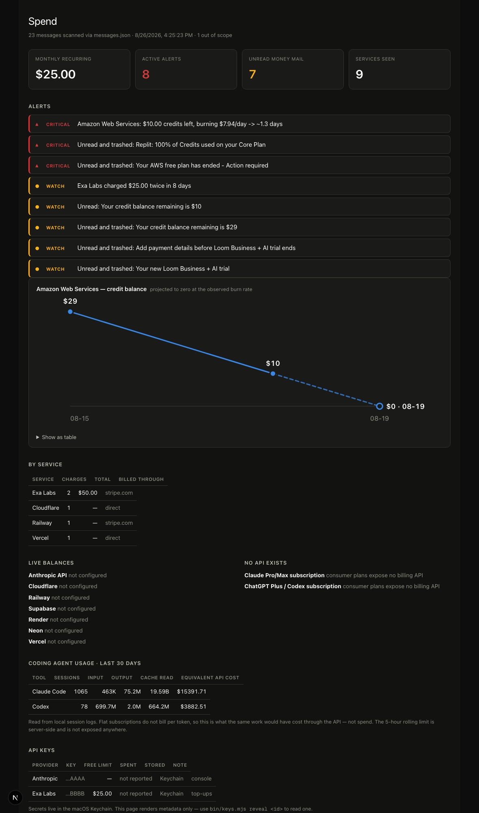

# LooseApi

**Every subscription tracker watches recurring charges. Cloud credits aren't charges.**

My AWS account burned through its free-plan credits and closed itself. Three
emails told me it was happening — `$29 credits remaining`, `$10 credits
remaining`, `your account has been closed`. All three were unread. Two were in
Trash. My card was never charged, so no bank-based tracker would ever have seen
it.

LooseApi reads billing mail, projects credit balances forward, and tells you
*before* the thing you depend on turns off.



Given those same three emails, it produces:

```
Amazon Web Services: $10.00 credits left, burning $7.94/day -> ~1.3 days
```

The account closed 1.3 days later.

---

## What it tracks

| | |
|---|---|
| **Credit burndown** | balances projected to zero at the observed rate |
| **Dev tools** | Vercel, Railway, Supabase, Render, Neon, Cloudflare, Replit |
| **Consumer subscriptions** | Netflix, Prime, Uber One, Spotify — no APIs exist, so email is the only source |
| **Trials** | dated conversions, and cancellations that suppress them |
| **API keys** | inventory with free-tier limits; secrets in the macOS Keychain, never on disk |
| **Coding agents** | Claude Code and Codex token usage from local session logs |

## Why email

Three sources could tell you what you spend, and only one sees credits:

| Source | Catches | Misses |
|---|---|---|
| **Email receipts** | signups, trials, credit balances, charges, closures | mail deleted before it is ever scanned |
| Card / bank | every real charge | free tiers, credits, trials — no transaction exists |
| Provider APIs | authoritative balances | only providers you connect; consumer plans have none |

A burning-down credit balance produces **zero** bank transactions. That is the
gap this fills.

## Install

macOS, Node 20+, no dependencies.

```bash
git clone https://github.com/lgoyal6/LooseAPI && cd LooseAPI
npm install          # Next.js, for the dashboard only
node bin/spend.mjs   # the CLI needs nothing
```

See [SETUP.md](SETUP.md) for Gmail access (~5 minutes) and optional provider
tokens.

## Use

```bash
spend                 # report
spend --all           # include personal-finance senders
spend --json          # machine-readable; the dashboard reads this
spend --digest        # push only time-critical alerts to Discord
spend --label         # file billing mail under Money/* in Gmail

npm run dev           # dashboard at /spend
npm test              # parser tests

bin/keys.mjs add <id> <provider> --free-limit 25   # secret read from stdin
bin/keys.mjs list                                  # metadata only
bin/keys.mjs reveal <id>                           # terminal only, never rendered
```

## Design decisions worth knowing

**Payment processors are not merchants.** A receipt from an `acct_*` Stripe
address tells you Stripe moved the money, not who took it. Processor mail is
attributed by subject line. Without this, every Stripe receipt files under
"Stripe".

**One payment can be two emails.** A merchant running an invoicing system in
front of a processor bills once and mails twice. Same service, same amount, same
day collapses to one charge. A genuine repeat on a different day still reports.

**Cancellations suppress trial alerts.** This caught a live false positive: a
trial flagged as converting to $29.99/mo had already been cancelled, and the
only evidence anywhere was prose in a founder's win-back email.

**The ledger outlives the inbox.** Events are keyed by message id and kept
permanently. Delete the email afterwards and the history survives, flagged as no
longer present in the mailbox. Billing mail is exactly the mail people delete.

**Alerts are gated by whether you can still act.** A charge that already
happened goes on the dashboard. A balance three days from zero interrupts you.

## Secrets

- API keys live in the **macOS Keychain**. `~/.devspend/keys.json` holds only
  provider, last four characters, and your free-tier note.
- One function returns a secret, so the blast radius is a single greppable call
  site. The dashboard has no code path to one.
- `bin/keys.mjs add` reads from stdin, never argv, so keys stay out of shell
  history and out of `ps`.
- All state lives in `~/.devspend/`, outside the repo. Nothing to commit by
  accident.

## What it cannot do

Stated plainly, because these are limits and not missing features:

- **Claude Pro/Max and ChatGPT/Codex subscriptions have no billing API.** Receipt
  email is the only source for the amount and renewal date.
- **Anthropic's cost API is organization-only.** The docs are explicit: *"The
  Admin API is unavailable for individual accounts."*
- **The 5-hour rolling limit is not exposed anywhere.** Token usage is read from
  local logs; the limit itself is server-side state with no endpoint.
- **Mail permanently deleted before any scan is unrecoverable.** Run it on a
  schedule so the ledger captures things first.
- **Per-key spend is only reported where a provider supports it.** Elsewhere it
  reads `not reported` rather than a misleading `$0.00`.

## License

MIT
